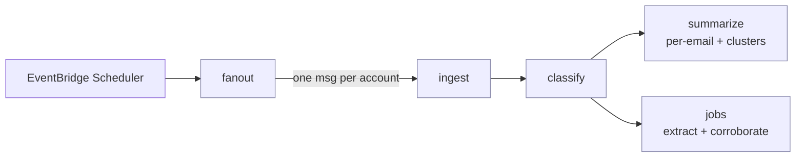
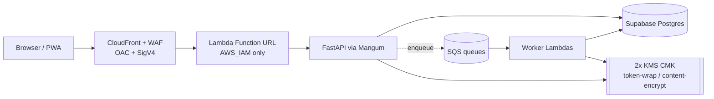

# Portfolio-Grade README Revamp

**Date:** 2026-06-02
**Author role:** Senior Principal Engineer (planning)
**Status:** Reviewed — decisions locked (§12). Ready to implement on the maintainer's go-ahead; **not yet implemented.**
**Live demo:** https://d2vki955e8ckrc.cloudfront.net/ (CloudFront; deployment to be polished as the project completes)
**Target artifact:** [`README.md`](../../README.md) (root) — full rewrite
**Reference:** [Kartik-Hirijaganer/X12-Parser-Encoder](https://github.com/Kartik-Hirijaganer/X12-Parser-Encoder)

---

## 1. Objective

Rewrite the root `README.md` so it reads as a **portfolio showcase** that signals senior/staff-level engineering to a hiring manager skimming for 60 seconds — while preserving the accurate "getting started + reference" content the current README already carries.

The current README is a competent *operator's* document (layout → setup → make targets → deploy). It buries the most impressive parts of this project (envelope encryption, SnapStart init discipline, LLM resilience, chaos drills, 13 ADRs) inside operational prose. The revamp **re-sequences the same truths into a narrative that sells**, mirroring the structure that makes the X12 reference README effective.

**This plan produces no code changes on its own.** It is a spec for the rewrite to be reviewed first.

---

## 2. Audience & success criteria

**Primary reader:** a hiring manager or staff+ engineer evaluating the candidate from the repo alone, skimming top-to-bottom, deciding in ~60 seconds whether this is a serious engineer.

A reviewer should, without scrolling past the fold, be able to state:
1. **What** it is (personal AI email agent, daily Gmail triage pipeline).
2. **That it is production-grade** (AWS serverless, IaC, CI/CD, encryption, tests) — not a toy.
3. **Where to look** for evidence of engineering judgment (ADRs, architecture, security docs).

**Success criteria for the finished README:**
- A hero screenshot + one-line value prop + honest badge row render above the fold.
- An **architecture diagram** renders natively on GitHub (Mermaid).
- An **"Engineering highlights"** section surfaces the 6–8 genuinely senior signals currently buried.
- Every quantitative claim is **real and traceable** to a file in this repo (see §8 source map). **Zero fabricated metrics.**
- All relative links resolve (`make link-check` stays green).
- Setup, make-command, and deploy reference content is retained (folded into a reference section), so the README is still operationally useful.

---

## 3. What makes the reference README work (analysis)

The X12 README is effective because it is **narrative-first, evidence-backed, and scannable**. Its section flow:

1. **Header** — title, tagline ("Spreadsheet in, insurance answers out"), badge row, quick-link nav.
2. **Why this exists** — problem framed in second person.
3. **Impact** — blockquote with metrics.
4. **What it does** — bold feature subsections + a short domain primer in italics.
5. **A closer look** — dashboard screenshot + demo link.
6. **How it works** — ASCII data-flow + Mermaid `flowchart LR` + architecture bullets.
7. **Built with** — grouped by layer (Library / API / Web / Infra & CI).
8. **Quick start** — usage example + local full-stack commands.
9. **Engineering highlights** — design decisions (monorepo, quality gates, property testing, serverless, drift checks).
10. **Project internals & reference** — structure table, API table, versions table, dev/deploy, PHI handling.
11. **Contributing** / **License** / **Footer narrative**.

**Patterns to adopt:** problem-before-tech opening; verb-object section headings; layered complexity (pitch → diagrams → tables → CLI); tables for reference data; Mermaid for architecture; minimal emoji; badge row up top; closing narrative that states it was built solo, end-to-end.

**The one pattern we must adapt, not copy:** the reference's "Impact" section cites real production metrics (94% claim-acceptance rate). **Briefed has no real user base** — it is a personal project. Copying that shape with invented numbers would be the single fastest way to lose a sharp reviewer's trust. See §5.

---

## 4. Current-state gap analysis

| Dimension | Current README | Target |
|---|---|---|
| Opening | Plain title + 3-line description | Tagline + value prop + badges + quick-nav + hero screenshot |
| Problem framing | None | "Why this exists" — the inbox-triage problem, second person |
| Visuals | None embedded | Hero `Dashboard.png` + `unsubscribe.png` embedded; clickable live-demo link/badge |
| Architecture | Prose only | Mermaid pipeline diagram + runtime-topology diagram + bullets |
| Senior signals | Scattered through "Deployment"/"Coding standards" | Dedicated **Engineering highlights** section, front-loaded |
| Stack | One dense paragraph | Badge row + "Built with" grouped by layer |
| Reference content | Strong (make table, version bumps, deploy) | **Kept**, moved under "Project internals & reference" |
| Proof of rigor | Implicit | Explicit: 443 tests, 13 ADRs, chaos drills, coverage gate, cost target |
| Closing | License only | Footer narrative (solo build, agentic workflow) + License |

**Net:** keep ~70% of the existing factual content; restructure and reframe it; add diagrams, screenshots, badges, and the highlights section.

---

## 5. Guiding principles (non-negotiable)

1. **Truth only.** Every number, capability, and claim must be verifiable in-repo. No invented adoption/business metrics. The "impact" story is **engineering rigor**, not fictional users. (See memory: Briefed is a personal project.)
2. **Lead with judgment, not features.** Hiring managers separate senior from junior on *trade-offs and operability*, not feature counts. Surface ADRs, fallbacks, blast-radius thinking, rollback rehearsals.
3. **Skimmable.** Short sections, tables, diagrams. Assume the reader never reads a full paragraph.
4. **Honest about scope.** Recommend-only (ADR 0006), 1.0.0 deferrals — stating limits *increases* credibility.
5. **No repo rules broken.** This is the README itself, so CLAUDE.md §5 (README auto-update) is satisfied by definition. No design-token or UI rules apply (docs only). Keep all relative links valid for `make link-check`.
6. **Don't oversell AI assistance, don't hide it.** Frame agentic development as a *demonstrated capability* (drove plans + ADRs + execution logs to ship a production system), not as a disclaimer that dilutes ownership. **Decided: include** (§12 Q2).

---

## 6. Target README structure (section-by-section spec)

Ordered top to bottom. Each entry: purpose, source of truth, and concrete content to write.

### 6.1 Header block
- **H1:** `Briefed`
- **Tagline (one line, bold):** something like *"Your inbox, triaged every morning — summaries of what matters, recommendations on what to mute."* (verb-object, concrete).
- **Badge row** (shields.io, static unless a real dynamic source exists). Proposed set — all defensible:
  - License: MIT · Python 3.11+ · FastAPI · React 18 + TypeScript · Vite · AWS Lambda + SnapStart · Terraform · Docker
  - Tests: link the badge to the GitHub Actions CI workflow (real). **Coverage badge: include** a static `coverage ≥ 80% (gated)` shield — the gate is enforced (`make coverage`, plan §20.1); it advertises the floor, not a live number. **Live-demo badge: include** a clickable badge → the CloudFront URL.
- **Quick-nav line:** `Live demo · Why · What it does · Architecture · Quick start · Engineering highlights · Docs` — **Live demo** → https://d2vki955e8ckrc.cloudfront.net/
- Draft markdown for the badge row is in §9.

### 6.2 Why this exists
- **Purpose:** problem framing in second person, no tech yet.
- **Content:** high-volume inbox; the signal (a few must-reads) is drowned by newsletters/notifications; triage is a daily tax; existing tools either over-automate (auto-archive/unsubscribe you regret) or do nothing. Briefed reads the inbox once a day and hands back a ranked, summarized brief — and **never acts on your behalf** (sets up the recommend-only safety stance).
- **Source:** README intro + ADR 0006 + release notes.

### 6.3 What it does
- **Purpose:** the product in 5–6 bold-led bullets.
- **Content (each a bold lead + one sentence):**
  - **Daily pipeline** — ingests new Gmail, runs once per morning on a schedule.
  - **Four-way classification** — must-read / good-to-read / ignore / waste, against a per-user rubric.
  - **Summaries** — condenses the must-read pile.
  - **Newsletter clustering** — rolls up tech-news / newsletter clusters instead of listing 30 items.
  - **Unsubscribe recommender** — rule-based + borderline-LLM; recommends, never clicks.
  - **PWA dashboard** — installable on iPhone, works offline (Workbox + Dexie).
- Optional italic one-liner clarifying *recommend-only* = it suggests, you decide.
- **Source:** release notes "What ships in 1.0.0" table + CLAUDE.md §9.

### 6.4 A closer look (screenshots)
- **Purpose:** visual proof it's real and polished.
- **Content:** embed the current assets (relative paths). Both map directly onto headline features:
  - **Hero:** `docs/screenshots/Dashboard.png` — the "Today's Digest" view: bucket counts (All / Must-read / Good-to-read / Ignore), per-email rows with category + sender + subject + received time, and the "Scan now" action. Illustrates the daily pipeline + four-way classification.
  - **Feature:** `docs/screenshots/unsubscribe.png` — the unsubscribe recommender: per-sender cards with a confidence score, an engagement/"waste" rationale, and Keep / Open-link / Mark-unsubscribed actions. Illustrates the recommend-only stance.
- Caption each. Both are wide desktop shots — stack vertically, or wrap in an HTML `<table>`/`` if sizing needs control.
- **Live demo (decided: include):** prominent link to **https://d2vki955e8ckrc.cloudfront.net/** — in the header quick-nav, as a clickable badge, and as a "▶ Live demo" line here. The deployment will be polished as the project completes; the link is live now.
- No mobile/login screenshot is currently in the repo. The PWA / offline / iPhone-install claim still stands via the release notes; add a mobile screenshot later if you want it shown (out of scope for this pass).

### 6.5 How it works (architecture)
- **Purpose:** prove distributed-systems literacy.
- **Content:** two Mermaid diagrams + 3–4 bullets.
  - **Diagram A — daily pipeline (SQS fan-out):** EventBridge Scheduler → `fanout` → per-account `ingest` → `classify` → branches to `summarize` and `jobs`. (Draft in §9.)
  - **Diagram B — runtime topology:** Browser → CloudFront (OAC + SigV4) → Lambda Function URL (`AWS_IAM`-only) → FastAPI via Mangum; worker Lambdas off SQS; Supabase Postgres; two KMS CMKs.
  - **Bullets:** one image, three entrypoints selected by `BRIEFED_RUNTIME` (local / lambda-api / lambda-worker); discriminated-union SQS message contracts; SnapStart-friendly module-level init.
- **Source:** CLAUDE.md §9 (big-picture architecture), release notes.

### 6.6 Built with
- **Purpose:** scannable stack, grouped by layer.
- **Content (grouped):**
  - **Backend:** Python 3.11, FastAPI, Pydantic v2, SQLAlchemy 2.0 async, Alembic, Mangum.
  - **AI/LLM:** OpenRouter routing — Gemini 1.5 Flash (primary) + Claude Haiku 4.5 (fallback); versioned prompt bundles + JSON Schemas; Promptfoo evals.
  - **Frontend:** React 18, TypeScript, Vite, PWA (Workbox), Dexie, TanStack Query.
  - **Data:** Supabase Postgres (asyncpg via pooler), two customer-managed KMS CMKs.
  - **Infra & CI:** AWS Lambda + SnapStart, SQS, EventBridge Scheduler, CloudFront + WAF, S3, SSM, Route 53/ACM; Terraform; GitHub Actions; Docker + LocalStack.
- **Source:** README stack line + CLAUDE.md + pyproject/package.json.

### 6.7 Quick start
- **Purpose:** prove it runs locally in minutes; keep the operator content.
- **Content:** carry over the existing block verbatim (it's accurate):
  ```bash
  git clone https://github.com/Kartik-Hirijaganer/Briefed.git
  cd Briefed
  cp .env.example .env        # BRIEFED_OPENROUTER_API_KEY + OAuth creds
  make bootstrap              # deps + docker-compose services
  make migrate                # alembic upgrade head
  make dev                    # backend :8000, frontend :5173
  ```
- Keep the local-URL line (Swagger/ReDoc/PWA) and the prereqs line.
- Trim the deep operational caveats (OAuth public-base-url, presidio note) **down** here and move full detail to the reference section to keep this section tight.

### 6.8 Engineering highlights ⭐ (the differentiator)
- **Purpose:** this is where the README earns the interview. 6–8 bullets, each = a senior signal + a one-line "why it's non-trivial," each linking to the ADR/code that proves it.
- **Content (all verified — see §8):**
  1. **Envelope encryption, per-row.** Two customer-managed KMS CMKs (token-wrap vs content-encrypt); per-row DEK; encryption context binds `{user_id, table, row_id}` so a leaked ciphertext can't be replayed across rows/users. → ADR 0008, `core/security.py`, `core/content_crypto.py`.
  2. **Resilient LLM layer.** Single `LLMClient` with a catalog-driven fallback chain, 3 retries (exp backoff + jitter, retryable-only), a circuit breaker (trips after 5 consecutive failures), per-model hard caps (Haiku 100/day), and per-call cost/token logging. → `llm/client.py`, ADR 0002/0009.
  3. **SnapStart cold-start discipline.** Settings + logging hydrate at *module import* (not in a factory) so SnapStart snapshots a warm process; heavy imports deferred to handler bodies, documented with per-file `ruff` ignores. → ADR 0003, `lambda_api.py`/`lambda_worker.py`.
  4. **Decoupled pipeline with typed contracts.** SQS fan-out per stage; every message is a frozen, `extra="forbid"` Pydantic discriminated union — no inline message shapes. → `workers/messages.py`.
  5. **Safety by design (recommend-only).** The agent never archives/unsubscribes/sends in 1.0.0; any destructive path must be gated + ADR'd. → ADR 0006.
  6. **Operability rehearsed, not assumed.** Blue/green Lambda alias deploy; rollback is one `update-alias`; chaos drills for DLQ, secret rotation, KMS revocation, and LLM-circuit failure; restore-from-backup drilled against a fresh Supabase project; every deploy writes an immutable `release_metadata` audit row. → `docs/operations/`, `deploy-prod.yml`.
  7. **Quality gates in CI.** `mypy --strict`, Ruff (pydocstyle/ANN/etc.), ESLint (google) + Prettier, 80% coverage floor with 4 modules pinned at 100%, dead-code checks (vulture/knip), `gitleaks` secret scan, markdown link-check. → Makefile, pyproject, release notes.
  8. **Decisions documented.** 13 ADRs covering compute, LLM routing, data store, auth, encryption, edge security, and product safety. → `docs/adr/`.
- **Format:** bold lead + sentence + trailing arrow-link. Keep each to ~2 lines.

### 6.9 Project internals & reference
- **Purpose:** absorb the existing operator content so nothing useful is lost; for the reader who keeps scrolling.
- **Subsections (mostly carried over / lightly trimmed):**
  - **Project structure** — keep the existing tree (it's good); optionally convert top entries to a Path | Purpose table to match the reference.
  - **API surface** — new short table (routers exist: accounts, auth, oauth, profile, rubric, emails, unsubscribes, session). Representative rows, link to Swagger. Don't enumerate every endpoint — point to `/docs`.
  - **Developer commands** — keep the existing make-targets table verbatim.
  - **Coding standards** — keep, condensed; link CLAUDE.md.
  - **Deployment** — keep, condensed; link infra READMEs + rollback runbook; keep the ~$8–11/mo cost target (a strong signal).
  - **Version bumps** — keep (single source of truth = `version.json`).
  - **Git workflow** — keep, condensed.
- **Source:** current README §§ "Developer commands", "Coding standards", "Deployment", "Version bumps", "Git workflow".

### 6.10 Documentation
- Keep the existing doc index (DESIGN.md, ADRs, architecture, operations, release, security). It's already strong; tighten to a compact list.

### 6.11 Contributing / License / Footer
- **Contributing:** one line → CONTRIBUTING.md.
- **License:** MIT → LICENSE.
- **Footer narrative (new — decided: include):** one short paragraph — designed and built solo, end to end (backend, frontend, infra, CI, docs), using an agentic dev workflow whose plans, ADRs, and execution logs live under `.claude/` and `docs/adr/`. Framed as a *capability* (drove the workflow to ship a production-grade system), not a disclaimer that dilutes ownership.

---

## 7. Supporting assets

| Asset | Action | Notes |
|---|---|---|
| Badge row | Author with shields.io static badges + CI badge linking to the real workflow | No fake dynamic coverage badge; static `≥80%` gate badge OK |
| Hero screenshot | Embed `docs/screenshots/Dashboard.png` | "Today's Digest" view; the hero |
| Feature screenshot | Embed `docs/screenshots/unsubscribe.png` | Unsubscribe recommender |
| Live-demo link + badge | Header quick-nav + clickable badge → CloudFront URL | https://d2vki955e8ckrc.cloudfront.net/ |
| Mermaid: pipeline | New ```mermaid``` block | Renders on GitHub natively; draft in §9 |
| Mermaid: runtime topology | New ```mermaid``` block | Draft in §9 |
| Mobile screenshot | Not present; optional later | PWA claim stands via release notes; out of scope |

No new images need to be produced — the two screenshots already exist in `docs/screenshots/`. Mermaid is text, committed inline.

---

## 8. Content source map (accuracy guarantee)

Every claim → its in-repo source. Use this during writing and review.

| Claim in README | Verified source |
|---|---|
| Daily pipeline ingest→classify→summarize/jobs | CLAUDE.md §9; `docs/release/v1.0.0.md` |
| Four-way classification + rubric | release notes; `services/classification/` |
| Recommend-only, never acts | ADR 0006; release notes |
| Two CMKs, per-row DEK, context `{user_id,table,row_id}` | ADR 0008; release notes §Architecture; `core/security.py`, `core/content_crypto.py` |
| argon2 + TOTP MFA | release notes §Architecture |
| LLM fallback / 3 retries / breaker@5 / Haiku 100/day / cost log | CLAUDE.md §9 "LLM abstraction"; ADR 0002/0009; `llm/client.py` |
| SnapStart module-init discipline | CLAUDE.md §9; ADR 0003; `lambda_api.py` |
| SQS fan-out + discriminated-union messages | CLAUDE.md §9; `workers/messages.py` |
| CloudFront OAC + SigV4, `AWS_IAM` Function URL | README "Deployment"; ADR 0003/0011 |
| Blue/green + rollback via update-alias | release notes; `docs/operations/rollback.md`; `deploy-prod.yml` |
| Chaos drills (DLQ, rotation, KMS revoke, circuit) | release notes §gates; `backend/tests/chaos/` |
| Restore-from-backup drilled | release notes; `docs/operations/restore.md` |
| `release_metadata` immutable audit row | release notes §Audit trail |
| 80% coverage gate; 4 modules @100% | release notes §gates; `make coverage` |
| ~$8–11/month cost target | release notes §cost; README |
| 13 ADRs | `ls docs/adr` (verified: 0001–0013) |
| **443 Python tests / 69 files; 40 FE test files** | verified via grep on 2026-06-02 |
| ~22K LOC backend app / ~10K LOC frontend src | verified via `wc -l` on 2026-06-02 |

> **Quantitative claims to feature:** "13 ADRs," "443 backend tests + Playwright e2e + Promptfoo evals + chaos drills," "80% coverage gate (4 modules at 100%)," "~$8–11/mo to run." These are real and impressive — use them. **Do not** state user counts, acceptance rates, or time-saved figures (none exist).

---

## 9. Draft snippets (ready to drop in on approval)

**Badge row (adjust slugs/colors to taste):**
```markdown
[](https://d2vki955e8ckrc.cloudfront.net/)


-success)
```

**Mermaid — daily pipeline (Diagram A):**
````markdown

````

**Mermaid — runtime topology (Diagram B):**
````markdown

````

**Engineering-highlight bullet (format example):**
```markdown
- **Envelope encryption, per row.** Two customer-managed KMS CMKs and a
  per-row data key; the encryption context binds `{user_id, table, row_id}`,
  so a leaked ciphertext can't be replayed across rows or users.
  → [ADR 0008](docs/adr/0008-kms-cmk-for-token-wrap-key.md)
```

---

## 10. Implementation steps (when approved)

1. **Branch:** work on the current feature branch or a fresh `docs/readme-revamp` (user's call; no push without permission per CLAUDE.md §4).
2. **Draft new `README.md`** following §6 order; reuse retained blocks (Quick start, make table, version bumps) verbatim.
3. **Embed screenshots** (§7) with relative paths; verify they render.
4. **Author both Mermaid diagrams** (§9); confirm they parse (GitHub preview / a Mermaid linter).
5. **Write Engineering highlights** (§6.8) with verified links (§8).
6. **Fold reference content** into §6.9 so nothing is lost.
7. **Re-verify counts** at write-time (re-run the grep/wc from §8) — numbers must be current, not stale from this plan.
8. **Run `make link-check`** — all relative links must resolve.
9. **Proofread** for the style guide (§11) and the truth principle (§5).
10. **Stop. Show diff. Await review.** No commit/push unless the user asks.

---

## 11. Style guide

- **Voice:** confident, plain, specific. No marketing fluff ("revolutionary," "seamless").
- **Headings:** verb-object / noun-phrase ("What it does," "How it works," "Engineering highlights").
- **Emoji:** at most one accent (e.g. a single ⭐ on Engineering highlights); none in body.
- **Tables** for any structured reference (commands, API, structure).
- **Code blocks** language-tagged (`bash`, `python`, `mermaid`).
- **Links** inline `[text](relative/path)`; never bare "PR #".
- **Length:** aim for a README a reviewer can skim in ~2 minutes; depth lives behind links to `docs/`.
- **Tense:** present tense, active voice.

---

## 12. Resolved decisions (locked 2026-06-02)

1. **Live demo — INCLUDE.** Link to **https://d2vki955e8ckrc.cloudfront.net/** now (header quick-nav, clickable badge, and a line in "A closer look"). Deployment will be polished as the project completes; the URL is live today.
2. **AI-assisted framing — INCLUDE.** Footer paragraph framing the agentic dev workflow as a capability (plans/ADRs/execution logs under `.claude/` + `docs/adr/`).
3. **Scope — FULL REWRITE** of root `README.md`. One canonical front door; no separate showcase doc.
4. **Coverage badge — INCLUDE.** Static `coverage ≥ 80% (gated)` shield; advertises the enforced floor, not a live number.
5. **Repo slug — CONFIRMED** `Kartik-Hirijaganer/Briefed` for the clone command and badge links.
6. **Screenshots — UPDATED.** Use the two current assets: `docs/screenshots/Dashboard.png` (hero) and `docs/screenshots/unsubscribe.png` (feature). The earlier notion-theme/login/mobile shots are no longer in the repo; a mobile screenshot can be added later if desired.

---

## 13. Risks & mitigations

| Risk | Mitigation |
|---|---|
| Fabricated/΅inflated metrics erode trust | §5 principle 1 + §8 source map; only ship verifiable numbers |
| Stale counts (tests/LOC drift) | §10 step 7 — re-verify at write-time, not from this plan |
| Mermaid fails to render on GitHub | Validate in preview; keep diagrams simple; ASCII fallback if needed |
| Broken relative links fail `make link-check` | §10 step 8 gate before declaring done |
| Losing useful operator content in the reframe | §6.9 explicitly absorbs all current reference sections |
| Over-claiming AI did the work | §12 Q2 — frame as capability, user decides wording |

---

## 14. Out of scope

- Any code, config, or infra change beyond `README.md` (and, only if the user later asks, embedding a new GIF asset).
- New screenshots or design work (existing three assets suffice).
- Changes to `docs/`, ADRs, CONTRIBUTING, SECURITY (linked, not edited).
- Committing or pushing (requires explicit user instruction per CLAUDE.md §4).

---

## 15. Acceptance checklist (definition of done for the rewrite)

- [ ] Hero screenshot + tagline + badges render above the fold.
- [ ] "Why this exists" frames the problem before any tech.
- [ ] Both Mermaid diagrams render on GitHub.
- [ ] "Engineering highlights" present with ≥6 verified, link-backed bullets.
- [ ] Every number traceable via §8; no fabricated usage metrics.
- [ ] All retained operator content (quick start, make table, version bumps, deploy) still present.
- [ ] `make link-check` green.
- [ ] Counts re-verified at write-time.
- [ ] Reads top-to-bottom as a portfolio piece in ~2 minutes.
- [ ] No commit/push performed without explicit user request.
