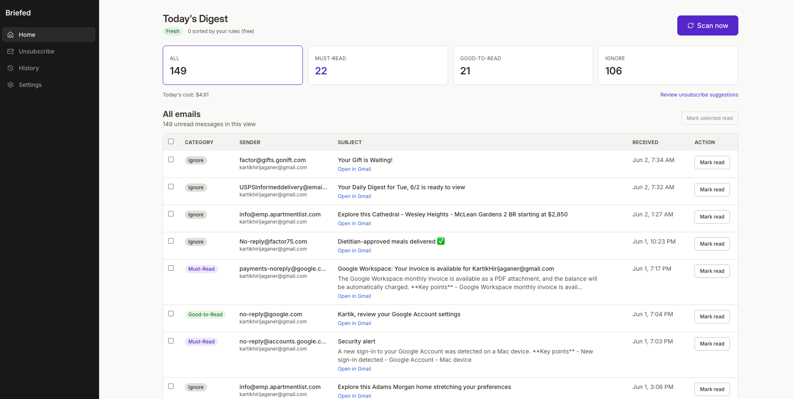
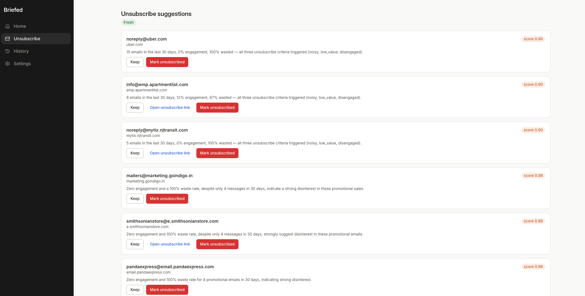
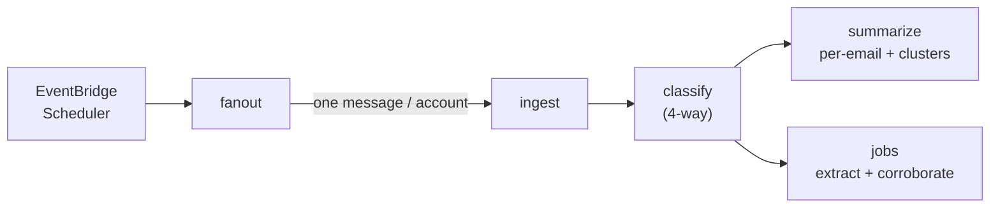
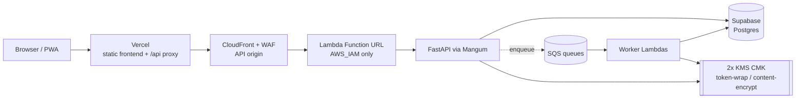

<div align="center">

# Briefed

**Your inbox, triaged every morning — a ranked brief of what matters, summaries of the must-reads, and recommendations on what to mute. It never acts without your explicit confirmation.**

[](https://briefed.vercel.app/)
[](#demo-video)
[](https://github.com/Kartik-Hirijaganer/Briefed/actions/workflows/ci.yml)

[](LICENSE)
<br/>


**[▶ Demo video](#demo-video)**  ·  **[Live demo](https://briefed.vercel.app/)**  ·  [Why](#why-briefed-exists)  ·  [What it does](#what-it-does)  ·  [Architecture](#how-it-works)  ·  [Quick start](#quick-start)  ·  [Engineering highlights](#engineering-highlights)  ·  [Docs](#documentation)

**Keywords:** AI email agent · Gmail triage · inbox zero · LLM pipeline · serverless SaaS · FastAPI · React PWA · AWS Lambda · Terraform · Supabase

<br/>



</div>

---

## Demo video


**Real-session product walkthrough** — recorded with Playwright against the authenticated live deployment, so it shows the current production UI, real category counts, unsubscribe recommendations, and account settings.

What it shows:

- Daily digest with real freshness, scan entry point, and four-way inbox classification.
- Per-email rationale, confidence, and summary before opening Gmail.
- Unsubscribe recommendations with sender volume, engagement, recent subjects, and user-controlled selection.
- Multi-account settings with the connected Gmail account and Add Gmail entry point, stopping before OAuth.

This is the public product walkthrough, not the Google OAuth verification
consent-flow video. The verification video must be recorded after
`briefed.email` is live and the OAuth app remains in Testing; the required flow
is tracked in
[`docs/operations/google-oauth-verification.md`](docs/operations/google-oauth-verification.md).

## Why Briefed exists

A real inbox gets a few emails a day that actually matter — and a hundred that don't. The signal drowns in newsletters, receipts, and notifications, so triage becomes a daily tax you pay before you've done any real work.

The tools that try to help tend to fall into two camps: the ones that do nothing useful, and the ones that over-automate — auto-archiving and auto-unsubscribing you into regret. Neither is trustworthy enough to actually hand your inbox to.

**Briefed reads your Gmail once a day and hands back a brief:** what's a must-read, what's safe to skim, what to ignore, and which senders are worth unsubscribing from — with a summary of the pile that matters. It stays user-controlled: destructive actions require explicit confirmation, and unsubscribe execution is gated behind a default-off capability ([ADR 0006](docs/adr/0006-recommend-only-in-release-1-0-0.md), [ADR 0014](docs/adr/0014-execute-unsubscribe-in-release-2.md)).

Public review is deliberately split from real Gmail access: `/demo` uses synthetic data for recruiters and reviewers, while the real `/app/*` path requires current Privacy Policy and Terms acceptance before Gmail-derived processing starts ([ADR 0015](docs/adr/0015-public-homepage-demo-and-enforced-consent.md)).

## What it does

- **Daily pipeline** — ingests new Gmail on a schedule and runs the whole brief end to end, unattended.
- **Four-way classification** — sorts every email into **must-read / good-to-read / ignore / waste** against a rubric you own and can edit.
- **Summaries** — condenses the must-read pile so you read the gist, not the thread.
- **Newsletter clustering** — rolls up newsletter and tech-news clusters into one digest entry instead of thirty rows.
- **Unsubscribe recommender** — rule-based with a borderline-LLM tiebreaker; it scores senders and explains *why*, then recommends. In Release 2, an explicit, confirmed action can execute supported one-click unsubscribes when the default-off capability is enabled.
- **Installable PWA** — a React dashboard that installs on iPhone and works offline (Workbox + Dexie).

> *User-confirmed by design:* Briefed surfaces the suggestion and reasoning first. Any destructive click is yours, and execute-unsubscribe remains behind a default-off capability flag.

## A closer look

The **digest above** is the home view — bucket filters at a glance, the full classified list on the left, the selected message summary on the right, and a one-tap *Scan now*. The other half of the product is the **unsubscribe recommender**: noisy senders ranked by volume, open-rate, and wasted-email signals, recent-subject context, explicit multi-select controls, Keep / unsubscribe actions you trigger yourself, and gated one-click execution only after explicit confirmation.

<div align="center">
  
</div>

▶ **Live demo:** https://briefed.vercel.app/

## How it works

**The daily run is an SQS fan-out pipeline.** A scheduler kicks off a fan-out that enqueues one job per connected account; each stage is its own queue and handler, so stages scale and fail independently.



**One image, three runtimes.** The same backend image ships an API and two worker entrypoints, selected by `BRIEFED_RUNTIME`. The frontend is hosted by Vercel; `/api/*` is proxied to the CloudFront-protected Lambda API origin, and the workers run off SQS.



- **`BRIEFED_RUNTIME`** selects `local` (uvicorn), `lambda-api` (Mangum), or `lambda-worker` / `lambda-fanout` (SQS dispatcher) from one codebase.
- **Typed message contracts** — every queue payload is a frozen Pydantic discriminated union (`extra="forbid"`); no message shapes are invented inline.
- **SnapStart-friendly init** — settings and logging hydrate at module import so SnapStart snapshots a warm process; heavy SDK imports are deferred to handler bodies.

## Built with

| Layer | Stack |
|---|---|
| **Backend** | Python 3.11 · FastAPI · Pydantic v2 · SQLAlchemy 2.0 (async) · Alembic · Mangum |
| **AI / LLM** | OpenRouter routing — Gemini 2.5 Flash (primary) + Claude Haiku 4.5 (fallback) · versioned prompt bundles + JSON Schemas · Promptfoo evals |
| **Frontend** | React 18 · TypeScript · Vite · PWA (Workbox + `vite-plugin-pwa`) · Dexie · TanStack Query · Framer Motion |
| **Data** | Supabase Postgres (asyncpg via the pooler) · two customer-managed KMS CMKs |
| **Infra & CI** | Vercel · AWS Lambda + SnapStart · SQS · EventBridge Scheduler · CloudFront + WAF · S3 · SSM · Route 53 / ACM · Terraform · GitHub Actions · Docker + LocalStack |

## Quick start

Prereqs: **Python 3.11+**, **Node 20+**, **Docker**, **Make**.

```bash
git clone https://github.com/Kartik-Hirijaganer/Briefed.git
cd Briefed
cp .env.example .env        # fill in BRIEFED_OPENROUTER_API_KEY + OAuth creds; other values optional
make bootstrap              # installs deps, starts docker-compose services
make migrate                # apply all Alembic migrations
make dev                    # backend on :8000, frontend on :5173
```

Swagger UI: http://localhost:8000/docs · ReDoc: http://localhost:8000/redoc · PWA: http://localhost:5173

The frontend is an npm workspace — `make bootstrap` runs `npm install` at the repo root, hoisting deps across `frontend/` and `packages/{ui,contracts}`. The Vite dev server proxies `/api` + `/oauth` to the local FastAPI instance so cookies + CSRF stay same-origin. Product knobs live in `packages/config/app_config.yml`; model routes and per-model caps live in `packages/config/llm/catalog.yml`.

The public homepage lives at `/` with a primary Try Demo path at `/demo`; the Connect Gmail path points to `/login` only when Gmail connect is enabled. Public content routes `/about`, `/privacy`, and `/terms` render without authenticated API calls. The authenticated app lives under `/app/*`. Vercel serves deep links through the SPA fallback in [`vercel.json`](vercel.json), and keeps `/api/*` same-origin by proxying to the CloudFront API origin.

The real Gmail path is gated by versioned legal consent. A stale or missing consent record blocks `/app/*` before dashboard routes mount, and the backend independently rejects manual scans, scheduled ingest work, and Gmail-affecting mutations until the current Privacy Policy and Terms versions have been accepted.

## Engineering highlights

The parts of this project I'd point a reviewer at — each links to the code or the decision record that backs it.

- **Envelope encryption, per row.** Two customer-managed KMS CMKs (one for OAuth-token wrapping, one for email content); a per-row data key; the encryption context binds `{user_id, table, row_id}`, so a leaked ciphertext can't be replayed across rows or users. → [ADR 0008](docs/adr/0008-kms-cmk-for-token-wrap-key.md), [`core/security.py`](backend/app/core/security.py), [`core/content_crypto.py`](backend/app/core/content_crypto.py)
- **A resilient LLM layer.** Every call goes through one client with a catalog-driven fallback chain, 3 retries (exponential backoff + jitter, retryable-only), a circuit breaker that trips after 5 consecutive failures, per-model hard caps (Haiku at 100 calls/day), and per-call cost/token logging. → [`llm/client.py`](backend/app/llm/client.py), [ADR 0002](docs/adr/0002-gemini-flash-primary-haiku-fallback.md), [ADR 0009](docs/adr/0009-openrouter-as-llm-routing-layer.md)
- **SnapStart cold-start discipline.** Settings and logging hydrate at *module import*, not in a factory, so SnapStart snapshots a warm process; heavy imports are deferred to handler bodies and documented with per-file `ruff` ignores. → [ADR 0003](docs/adr/0003-lambda-snapstart-over-fargate.md), [`lambda_api.py`](backend/app/lambda_api.py)
- **A decoupled pipeline with typed contracts.** SQS fan-out per stage; every message is a frozen, `extra="forbid"` Pydantic discriminated union — no inline message shapes anywhere. → [`workers/messages.py`](backend/app/workers/messages.py)
- **Public demo, real consent.** `/`, `/about`, `/privacy`, and `/terms` are public no-API surfaces; `/demo` is seeded synthetic data with `/api/*` blocked; `/app/*` is server-gated by versioned Privacy Policy and Terms acceptance before real Gmail processing. → [ADR 0015](docs/adr/0015-public-homepage-demo-and-enforced-consent.md)
- **Safety by design.** The agent never archives, unsubscribes, or sends in 1.0.0; later destructive paths are narrow, explicit, gated, and documented in ADRs. → [ADR 0006](docs/adr/0006-recommend-only-in-release-1-0-0.md), [ADR 0013](docs/adr/0013-gmail-mark-read-write-scope.md), [ADR 0014](docs/adr/0014-execute-unsubscribe-in-release-2.md)
- **Operability rehearsed, not assumed.** Blue/green Lambda alias deploys; rollback is a single `update-alias`; chaos drills cover DLQ replay, secret rotation, KMS-key revocation, and the LLM circuit breaker; restore-from-backup is drilled against a fresh Supabase project; every deploy writes an immutable `release_metadata` audit row. → [`docs/operations/`](docs/operations/), [`deploy-prod.yml`](.github/workflows/deploy-prod.yml)
- **Quality gates in CI.** `mypy --strict`, Ruff (pydocstyle + type-annotation + more), ESLint (`eslint-config-google`) + Prettier, an 80% coverage floor with critical modules pinned at 100%, dead-code checks (vulture + knip), `gitleaks` secret scanning, and a markdown link-checker. → [Makefile](Makefile), [`pyproject.toml`](pyproject.toml)
- **Decisions are documented.** **15 ADRs** cover compute, LLM routing, data store, auth, encryption, edge security, public demo access, and product safety — the *why* behind every load-bearing choice. → [`docs/adr/`](docs/adr/)

**By the numbers:** ~22K LOC backend · ~10K LOC frontend · **504 backend tests** across 70 files + 43 frontend test suites · Playwright e2e + Promptfoo prompt-evals + chaos drills · 15 ADRs · runs for **~$8–11/month** including two customer-managed KMS keys.

## Project internals and reference

### Project structure

```
.
├── backend/            FastAPI service + Lambda handlers + Dockerfile (Python 3.11+)
│   ├── app/            Application code (api, core, db, domain, llm, services, workers, …)
│   ├── alembic/        SQLAlchemy migrations
│   ├── eval/           Promptfoo config + golden set + thresholds
│   └── tests/          unit/ + integration/ + chaos/ suites
├── frontend/           React PWA dashboard (Vite + TypeScript)
├── packages/           Shared contracts / prompts / config / UI primitives
│   ├── contracts/      OpenAPI source of truth + provider types
│   ├── prompts/        Versioned LLM prompt bundles + JSON Schemas
│   ├── config/         Runtime YAML config, LLM catalog, seeds, schemas
│   └── ui/             Design tokens + reusable React primitives
├── infra/terraform/    Lambda + SnapStart + SQS + SSM + S3 + CloudFront +
│                       WAF + Route 53 + ACM + two customer-managed KMS CMKs
├── docs/
│   ├── adr/            Architecture Decision Records (0001–0015)
│   ├── architecture/   Data model, pipeline, system diagrams
│   ├── operations/     Runbook, alarms, restore + rollback drills
│   ├── release/        Release notes + announcement drafts
│   └── security/       SECURITY.md + threat model
├── tests/              Cross-service e2e + fixtures + prompt-evals
├── CLAUDE.md           Project rules for the agent workflow
├── DESIGN.md           Canonical design system + tokens
├── Makefile            Canonical developer commands (CI calls the same targets)
└── docker-compose.yml  Local Postgres + LocalStack
```

### API surface

All routes are mounted under `/api/v1`. The full interactive spec is at `/docs` (Swagger) and `/redoc`.

| Resource | Path | Representative operations |
|---|---|---|
| Auth | `/auth` | Session logout (local auth provider: argon2 + TOTP MFA) |
| Google OAuth | `/oauth/gmail` | Start authorization-code flow · callback exchange |
| Accounts | `/accounts` | List · update settings · disconnect · remove mailbox |
| Rubric | `/rubric` | CRUD classification rules |
| Emails | `/emails` | List classified emails · mark read · override bucket |
| Unsubscribes | `/unsubscribes` | List recommendations · dismiss · confirm · execute (flagged) |
| Hygiene | `/hygiene` | Inbox-hygiene summary counters |
| Legal consent | `/legal/consent` | Get current/accepted policy versions · accept Privacy Policy and Terms |
| Profile | `/profile` | Get / update profile · get / update schedule |

### Developer commands

The top-level [Makefile](Makefile) is the single source of truth — CI calls the same targets.

| Command              | What it does                                                           |
|----------------------|------------------------------------------------------------------------|
| `make bootstrap`     | Install Python + Node deps; start docker-compose services.             |
| `make dev`           | Run backend + frontend with hot-reload (Postgres via docker-compose).  |
| `make test`          | Run pytest + vitest and print a unified summary.                       |
| `make lint`          | Ruff + mypy + ESLint + Prettier check.                                 |
| `make lint-tokens`   | Fail if raw hex / `rgb()` colors appear outside `tokens.css` (theme guard). |
| `make dead-check`    | Find unused code (vulture for Python; knip for the frontend).          |
| `make coverage`      | Enforce the 80% line-coverage floor.                                   |
| `make docs`          | Regenerate `packages/contracts/openapi.json` + frontend TS client.     |
| `make e2e`           | Playwright e2e (sets `PLAYWRIGHT=1`).                                  |
| `make eval`          | Promptfoo prompt evals via pinned `npx` (sets `EVAL=1`).               |
| `make migrate`       | `alembic upgrade head`.                                                |
| `make secrets-lint`  | `gitleaks detect` full-repo scan.                                      |
| `make link-check`    | Verify every relative markdown link resolves.                          |
| `make deploy-dev`    | `terraform apply` the dev environment (requires `IMAGE_URI=<ecr>...`). |

### Coding standards

Enforced by tooling and documented in [CLAUDE.md](CLAUDE.md):

- **Python** — Google-style docstrings, full type hints, Pydantic for every structured payload. Lint via Ruff; type-check via `mypy --strict`.
- **React / TS** — Google-style JSDoc on every exported symbol, strict TS, named exports. Lint via ESLint (`eslint-config-google` + `jsdoc`); format via Prettier.

### Deployment

The frontend deploys to Vercel from the repo root: install with `npm install`, build with `npm run build`, and publish `frontend/dist`. [`vercel.json`](vercel.json) keeps `/api/*` same-origin by rewriting it to the existing CloudFront/Lambda API origin before the SPA fallback to `/index.html`; it also mirrors the CloudFront security headers because the public SPA is no longer served through CloudFront.

The backend still runs on AWS Lambda behind CloudFront and AWS WAF. CloudFront fronts the Lambda Function URL with Origin Access Control + SigV4 signing; the Function URL is `AWS_IAM`-only and not publicly callable ([ADR 0003](docs/adr/0003-lambda-snapstart-over-fargate.md), [ADR 0011](docs/adr/0011-cloudfront-oac-over-api-gateway.md)). Set `BRIEFED_PUBLIC_BASE_URL` / Terraform `public_base_url` to the Vercel or custom-domain origin so the Google OAuth callback URI is generated as `https://<public-origin>/api/v1/oauth/gmail/callback` and cookies stay scoped to the browser-facing origin. Production backend deploys still go through the [`deploy-prod` workflow](.github/workflows/deploy-prod.yml) — annotated tag → blue/green Lambda alias swing → `release_metadata` row written. Rollback is a single `aws lambda update-alias` per function; [`docs/operations/rollback.md`](docs/operations/rollback.md) is the operator playbook. Steady-state cost target is **~$8–11/month**, including two customer-managed KMS CMKs.

Google OAuth verification for the public Gmail path is tracked in
[`docs/operations/google-oauth-verification.md`](docs/operations/google-oauth-verification.md).
Until custom-domain verification, OAuth approval, and CASA assessment are
complete, keep the OAuth app in Testing, keep the production Connect Gmail flag
off, and use the synthetic demo for public review.

### Version bumps

**App version.** The single source of truth for the app version is [`packages/contracts/version.json`](packages/contracts/version.json). Bump it in one place — backend and frontend both read from it — then run `make docs` (or `/make-docs`) to regenerate the OpenAPI spec with a matching `info.version` pin.

**Legal policy versions.** When Privacy Policy or Terms text materially changes, bump the backend enforcement constants in [`backend/app/core/consent.py`](backend/app/core/consent.py): `CURRENT_PRIVACY_POLICY_VERSION` and `CURRENT_TERMS_VERSION`. Mirror the same values in [`frontend/src/content/legal.ts`](frontend/src/content/legal.ts): `PRIVACY_POLICY_VERSION` and `TERMS_VERSION`, and set `POLICY_EFFECTIVE_DATE` to the deploy date for the published policy text. Then verify with `make test` and `make link-check`; run `make docs` as well if the consent API schema changed.

### Git workflow

- Feature branches; PRs into `main`.
- Conventional Commits (`feat:` / `fix:` / `refactor:` / `docs:` / `chore:`).

## Documentation

- [DESIGN.md](DESIGN.md) — canonical design system: a single fixed Notion theme (dark desktop sidebar, light main). Tokens, typography, motion, and contrast numbers all live here. Read before any UI change.
- [docs/adr/](docs/adr/) — the 15 architecture decision records (0001–0015).
- [docs/architecture/](docs/architecture/) — system diagrams + data model.
- [docs/operations/](docs/operations/) — runbook, alarms, restore + rollback drills, secrets rotation.
- [docs/release/](docs/release/) — 1.0.0 release notes + announcement draft.
- [docs/security/](docs/security/) — SECURITY.md + threat model.

## Contributing

See [CONTRIBUTING.md](CONTRIBUTING.md).

## License

[MIT](LICENSE).

---

<sub>Briefed was designed and built solo — backend, frontend, infrastructure, CI, and docs. The 15 ADRs in [`docs/adr/`](docs/adr/) document the full decision trail end to end.</sub>
